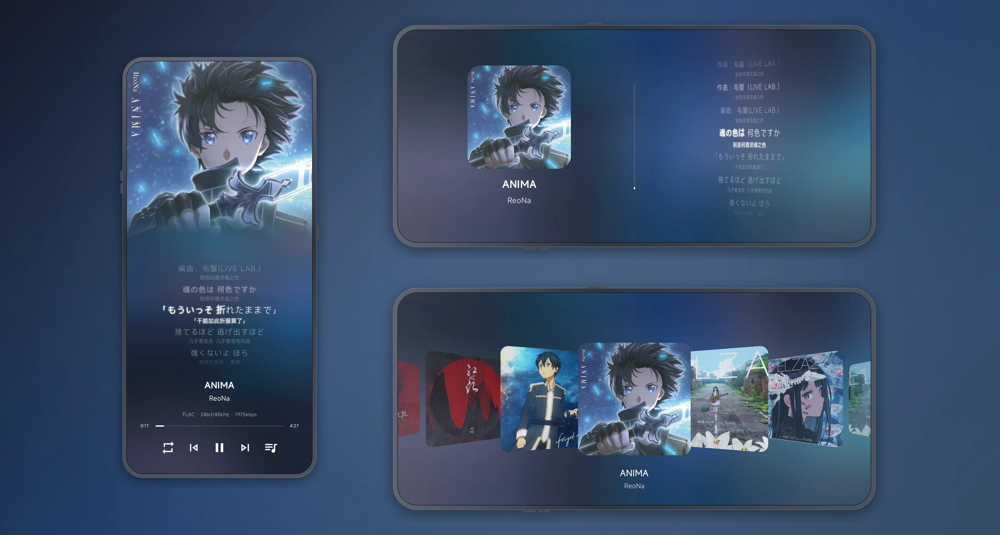
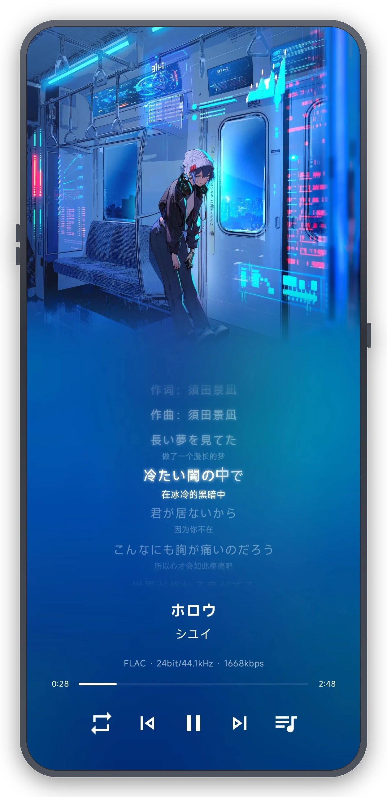
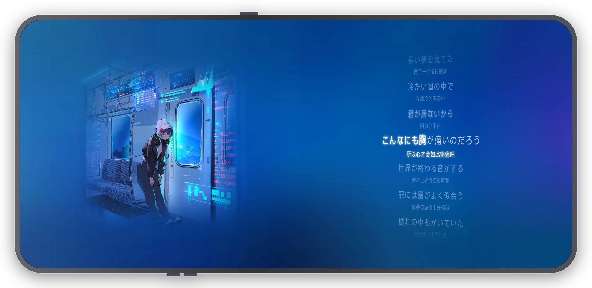
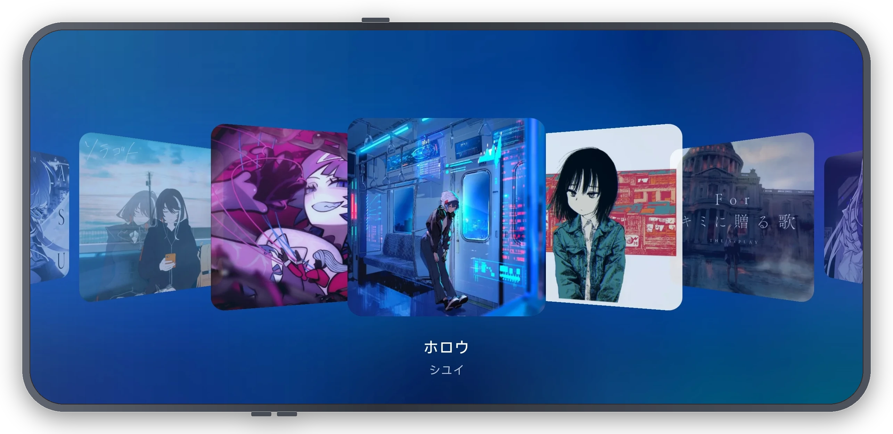

<div align="center">


# 忆潮音乐 · Echo Tide

**沉浸式音乐播放器**

**这是一个风格老派轻量且简约的沉浸式音乐播放器**

[English](README.md) | **简体中文**




</div>

## 产品展示

无论是竖屏还是横屏均采用最少干扰最大沉浸体验设计。

| 竖屏播放器 | 横屏播放器 | 横屏 3D 封面轮播 |
| :---: | :---: | :---: |
|  |  |  |

> 截图为真机运行画面,曲目封面与歌词版权归原作者所有,仅作界面演示。

## 技术栈

| 层次 | 技术 |
| --- | --- |
| 语言 | Kotlin 2.4.20 |
| UI | Jetpack Compose(BOM 2026.09.00)+ Material 3 |
| 播放 | Media3 ExoPlayer 1.11.1 + MediaSessionService |
| 导航 | AndroidX Navigation3 1.2.0(类型安全路由) |
| 依赖注入 | 手动 DI(单例挂在 Application) |
| 持久化 | DataStore Preferences 1.2.1 |
| 图片加载 | Coil 3.6.3 |
| 网络 | OkHttp 5.5.0 |
| 序列化 | kotlinx.serialization 1.11.0 |
| 异步 | kotlinx.coroutines 1.11.0(含 coroutines-guava 桥接 MediaController Future) |
| 自适应布局 | androidx.window 1.5.1、material3-adaptive 1.3.0 |
| 生命周期 | androidx.lifecycle 2.11.0、activity-compose 1.13.0 |
| 构建 | AGP 9.4.1、Gradle 9.8.0、refreshVersions |

## 项目结构

```
.
├── app/
│   └── src/main/
│       ├── kotlin/com/yichao/evilgodxu/
│       │   ├── data/                    # 数据层
│       │   │   ├── cache/               #   缓存台账(分类 / 占用统计 / 冷启动回收)
│       │   │   ├── music/               #   曲库扫描 / 在线音源 / 元数据 / 代理音源
│       │   │   │   ├── api/             #     搜索服务、翻译接口与网络客户端
│       │   │   │   ├── analysis/        #     无损格式、音频信息读取、逐字歌词对齐、FFT 与全曲频谱
│       │   │   │   ├── blacklist/       #     黑名单存储
│       │   │   │   ├── clip/            #     分享、默认铃声 / 闹钟设置、可读 URI 解析、频谱图导出
│       │   │   │   ├── download/        #     在线曲目下载与缓存
│       │   │   │   ├── metadata/        #     封面管理、元数据与歌词读写(区间流式标签读写)、元数据缓存、相册图片写入
│       │   │   │   ├── model/           #     曲目与搜索数据模型(以平台键为身份)
│       │   │   │   ├── panel/           #     面板状态持有器、搜索逻辑与逐字对齐入口
│       │   │   │   ├── playback/        #     播放状态、播放器工具、队列切换、歌单排序、USB 直出与免打扰、按设备音频输出(含缓冲策略)、输出延迟实测、音频信息快照(含蓝牙链路与编解码器解析)
│       │   │   │   ├── proxy/           #     代理音源(导入 / 解析 / 引擎 / 存储)与自定义平台注册表
│       │   │   │   ├── recommend/       #     每日推荐(榜单候选池、歌词特征、TF-IDF、MMR)
│       │   │   │   ├── MusicScanner.kt  #     MediaStore 扫描与曲目补全
│       │   │   │   └── PlaylistRefresher.kt  # 播放列表刷新流程
│       │   │   ├── playlist/            #   歌单存储(智能 / 自定义)与分组
│       │   │   ├── repository/          #   设置仓库
│       │   │   └── settings/            #   设置 DataStore、播放与歌词排版偏好、启动语言镜像
│       │   ├── floatingwindow/          # 悬浮窗 / 迷你播放器视图管理、控制器与权限流程
│       │   │   └── miniplayer/          #   迷你播放器浮层 / 条 / 播放列表面板
│       │   ├── localization/            # 应用内多语言管理
│       │   ├── log/                     # CrashLogManager
│       │   ├── navigation/              # Navigation3 类型安全路由与导航宿主
│       │   ├── permission/              # 权限、悬浮窗授权与电池优化白名单监控
│       │   ├── screens/                 # 页面(首页 / 设置 / 存储 / 排版 / 频谱 / 元数据)
│       │   │   ├── home/                #   首页播放器 + 权限流程 + 歌单 + 在线搜索
│       │   │   │   ├── compact/         #     竖屏组装器、播放器与部件
│       │   │   │   ├── expanded/        #     横屏组装器、播放器与部件
│       │   │   │   └── component/       #     analysis / audioinfo / bar / dialog / panel / permission / player / playlist / queue / search / shell / swipe
│       │   │   ├── settings/            #   外观 / 黑名单 / 存储 / 语言 / 播放 / 代理音源 / 关于
│       │   │   ├── cache/               #   存储 / 缓存管理
│       │   │   ├── spectrum/            #   频谱分析页(compact / expanded / component)
│       │   │   ├── typography/          #   歌词排版设置
│       │   │   └── metadata/            #   元数据编辑页(compact / expanded / component)
│       │   ├── service/                 # MediaSessionService 播放引擎
│       │   ├── theme/                   # Material 3 配色与字体
│       │   ├── ui/                      # 全局共享 UI(component:封面渐隐 CoverFade、对话框骨架 AppDialog;另含 component/dialog、component/player、component/section、icons)
│       │   ├── update/                  # 检查更新、应用内更新与 APK 校验
│       │   ├── utils/                   # 通用工具
│       │   ├── windowsize/              # 窗口尺寸类与横屏形态判定
│       │   ├── App.kt                   # Application 入口(持有单例与组合局部)
│       │   ├── AppContent.kt            # 根可组合项(导航宿主与全局弹窗)
│       │   ├── MainActivity.kt          # 唯一 Activity(系统栏、外部意图、启动语言)
│       │   └── MainViewModel.kt         # Activity 专属 ViewModel(含 AppUiState)
│       └── res/                         # 资源(values / values-en)
├── gradle/
│   ├── libs.versions.toml               # 版本目录(依赖管理)
│   └── wrapper/
├── docs/                                # 代理音源规范、界面截图与注意事项
├── LICENSE
├── build.gradle.kts
├── settings.gradle.kts
└── gradle.properties
```

自定义代理音源的接口规范见 [忆潮代理音源规范](docs/忆潮代理音源规范.md)。

## 架构

应用遵循 **MVVM + 单向数据流**:状态由 `ViewModel` 经 `UiState` 流向界面,事件则由界面回传;共享数据逻辑位于 `data/` 层并通过 Repository 暴露,对象图由**手动依赖注入**组装——每个应用级单例都在 `Application` 上创建,并通过具名组合局部(CompositionLocal)暴露给界面树。

页面代码采用**分形态组装(per-form assembly)模式**:

- `{Screen}Screen.kt` — 页面入口:在 compact/expanded 形态间分发并处理跨形态副作用,不承载布局
- `{Screen}ViewModel.kt` / `{Screen}UiState.kt` — 页面级状态与事件
- `compact/`、`expanded/` 下的 `{Screen}Assembly` — 按窗口尺寸类与旋转状态选择对应形态的组装器
- `component/` — 页面专用可组合项,按语义子目录分组(如 bar/、dialog/、panel/、playlist/、player/、search/、shell/、swipe/)

被两个及以上功能复用的代码上提至顶层(`data/`、`theme/`、`utils/`、`ui/`),仅单页使用的代码留在页面模块内。播放逻辑位于 `data/music`,经窗口级 `MusicPanelStateHolder` 暴露给界面;实际播放由 `service/MusicPlaybackService`(Media3 ExoPlayer + `MediaSessionService`)驱动。

以下几处决策决定了整个代码库的形态:

- **需跨重组与旋转存活的状态置于界面树之外**——首页面板状态与共享播放状态持有者都因此得以保留,最近一次播放状态还会镜像落盘,使冷启动首帧即为完整内容。

- **推荐在粗排阶段过滤,而非逐曲筛选**——被拉黑的曲目直接在粗排中跳过,其相关特征只做降权,因此一次拉黑不会退化成逐曲过滤。

- **分析在页面级会话中运行**——频谱分析在页面作用域内把整曲解码为可直接渲染的时频矩阵,离开页面即取消;页面只负责查看与导出。

- **各平台歌词统一收口**——`LyricCodec` 把 LRC、QRC、KRC、lrcx 归一为同一份 `LyricLine` 列表,逐字时间轴一律为绝对毫秒,跨平台比较与「逐字优先、无字标签则退化为逐行」的策略只需实现一次。

- **音频信息面板读的是播放链路**——`AudioInfoCollector` 从共享播放状态组装快照,同一面板覆盖扬声器、USB 解码器与蓝牙链路,界面侧无需分支。

- **标签改写走区间 I/O**——`TagSource` 只暴露区间读取与区间搬运,数百 MB 的高解析文件改标签时不再整文件驻留内存。

- **元数据编辑是搭在该路径上的页面**——编辑会话按曲目区分,每次回到前台重读文件标签,未到自动保存窗口的改动在离开时补写,因此该页没有保存入口。

## 权限

| 权限 | 用途 |
| --- | --- |
| 悬浮窗 | 悬浮音乐面板与迷你播放器 |
| 全部文件访问 | 导入与管理本地音乐文件 |
| 音乐访问(`READ_MEDIA_AUDIO`) | 读取设备曲库并播放 |
| 图片(`READ_MEDIA_IMAGES`) | 内嵌封面与本地封面候选;Android 14「选中的照片」部分授权同样视为已授权 |
| 蓝牙(`BLUETOOTH_CONNECT`) | 读取当前蓝牙输出设备的名称、地址与协商出的编解码器(音频信息) |
| 前台服务(`mediaPlayback`、`FOREGROUND_SERVICE_MEDIA_PLAYBACK`) | 后台播放 + 通知栏 / 锁屏控制 |
| 通知(`POST_NOTIFICATIONS`) | 版本更新下载完成通知(Android 13+) |
| 网络(`INTERNET`、`ACCESS_NETWORK_STATE`) | 在线搜索、歌词与封面获取、检查更新 |
| 音频设置(`MODIFY_AUDIO_SETTINGS`) | 播放引擎的音频配置,含 USB 直出按设备声明申请动态混音器属性所需 |
| 免打扰(`ACCESS_NOTIFICATION_POLICY`) | USB 直出期间自动切至「仅闹钟」档位,屏蔽通知与铃声干扰(不压制媒体流) |
| 唤醒锁(`WAKE_LOCK`) | 熄屏后维持播放引擎运行 |
| 忽略电池优化(`REQUEST_IGNORE_BATTERY_OPTIMIZATIONS`) | 避免后台播放被系统回收 |
| 安装应用(`REQUEST_INSTALL_PACKAGES`) | 应用内更新时拉起系统安装器 |
| 修改系统设置(`WRITE_SETTINGS`) | 将曲目设为默认来电铃声 / 闹钟铃声 |

权限由引导对话框逐项申请:三项曲库权限为必需,蓝牙、通知与电池优化白名单为可选且仅在缺失时列出。Android 14 的「选中的照片」部分授权与完整图片权限同等看待——查询仍能返回用户已选中的图片,足以挑选封面。当前输出为蓝牙设备时,音频信息面板还会就地申请蓝牙权限。

## 快速开始

### 环境要求

- JDK 21
- Android Studio(建议最新稳定版)
- 包含 API 37(`compileSdk`)的 Android SDK

### 构建

```bash
git clone https://github.com/Evilgodxu/EchoTide-Music.git
cd EchoTide-Music

# 调试包
./gradlew assembleDebug

# 发布包(需先配置签名,见下文)
./gradlew assembleRelease
```

APK 输出为 `app/build/outputs/apk/` 下的 `EchoTideMusic-<版本号>-arm64-v8a.apk`,仅构建 `arm64-v8a` ABI。

### 发布签名

Release 构建从项目根目录的 `local.properties` 读取签名凭据:

```properties
KEYSTORE_PASSWORD=你的签名库密码
KEY_ALIAS=jh
KEY_PASSWORD=你的别名密码
```

签名库文件默认位于项目根目录 `jh.keystore`(如需调整请修改 `app/build.gradle.kts` 中的 `storeFile`)。两个文件均已被 git 忽略,请勿提交。

### 宣传图

README 使用的带壳截图与首屏宣传图由 `tools/make_promo_hero.py` 从 `docs/Screenshot/` 下的真机截图生成:脚本按屏幕短边等比推导边框厚度、机身圆角与侧键位置,输出透明背景的三张带壳截图(`device-*.webp`)与合成后的 `promo-hero.webp`。

```bash
python tools/make_promo_hero.py
```

## 免责声明

搜索服务依赖公共网络接口。内置搜索服务仅覆盖基础的歌曲、封面与歌词搜索,并不承诺播放能力——只有当音源返回可播放直链时,应用才谈得上试听与免费歌曲;音质升级依赖代理音源。歌词自动补译依赖有道公开的免鉴权翻译接口,其可用性、限流策略与译文质量均由该服务决定。接口可用性随地区与歌曲而异。应用仅供个人学习交流使用,请支持正版版权方。

## 致谢

- 网易云音乐解析早期参考 [Qplayer](https://github.com/TIMER-err/qplayer)
- 列表拖拽排序取自 [Reorderable](https://github.com/Calvin-LL/Reorderable),现已在应用内自行实现(算法等价)
- 基于 [musicdl](https://github.com/CharlesPikachu/musicdl) 实现网易云音乐、酷狗、酷我、QQ 的 Kotlin 原生音源解析

## License

[AGPL-3.0](LICENSE) © 2026 Evilgodxu
